# Network Security project for Phishing Dataset

## Overview

This is a full-scale MLOps project that implements an end-to-end machine learning pipeline for network security applications. The project covers the complete ML lifecycle, including data ingestion, preprocessing, model training, evaluation, deployment, and continuous monitoring using cloud platforms like AWS.

### Features
- Automated Data Ingestion from structured network datasets\
- Data Preprocessing & Validation using defined schemas
- Model Training & Evaluation using state-of-the-art ML algorithms
- Cloud Integration with AWS S3 for model storage and retrieval
- CI/CD Pipeline for continuous integration and deployment
- Dockerization for seamless deployment
- Batch Prediction Pipeline for inference on new data
- Logging & Exception Handling for debugging and monitoring

### Project Structure
```bash
├── mohammedsaim-quadri-networksecurity/
│   ├── README.md                # Project Documentation
│   ├── app.py                   # Main Application Entry Point
│   ├── Dockerfile               # Docker Configuration for Deployment
│   ├── main.py                  # Training Pipeline Execution
│   ├── push_data.py             # Data Pusher for Cloud Storage
│   ├── requirements.txt         # Dependencies
│   ├── setup.py                 # Package Setup
│   ├── test_mongo.py            # MongoDB Connectivity Testing
│   ├── data_schema/
│   │   └── schema.yaml          # Data Schema Definitions
│   ├── final_models/            # Trained Models
│   │   ├── model.pkl            # Final ML Model
│   │   └── preprocessor.pkl     # Data Preprocessing Pipeline
│   ├── Network_Data/            # Raw Network Datasets
│   │   └── phisingData.csv
│   ├── networksecurity/         # Core Codebase
│   │   ├── cloud/               # AWS S3 Integration
│   │   ├── components/          # ML Pipeline Components
│   │   ├── constant/            # Constants & Configs
│   │   ├── entity/              # Entity Definitions
│   │   ├── exception/           # Custom Exception Handling
│   │   ├── logging/             # Logging Mechanisms
│   │   ├── pipeline/            # Training & Prediction Pipelines
│   │   └── utils/               # Utility Functions
│   ├── templates/
│   │   └── table.html           # UI Component
│   ├── valid_data/
│   │   └── test.csv             # Validated Test Data
│   └── .github/workflows/
│       └── main.yml             # GitHub Actions Workflow
```


```mermaid
%%{init: {'theme': 'base', 'themeVariables': {'primaryColor': '#bbdefb', 'edgeLabelBackground':'#ffffff'}}}%%

graph TD;
    
    %% Data Pipeline %%
    A(["🗄️ Data Collection"]) -->|Ingest Data| B(["📥 Data Ingestion"])
    B -->|Validate Data| C(["✅ Data Validation"])
    C -->|Transform Data| D(["🔄 Data Transformation"])
    D -->|Train Model| E(["🤖 Model Training"])
    E -->|Evaluate Model| F(["📊 Model Evaluation"])
    F -->|Store Model| G(["📁 Model Registry (S3)"])

    %% Deployment %%
    G -->|Deploy Model| H(["🚀 Model Deployment"])
    H -->|Serve Predictions| I(["🌍 Web Service (Flask API)"])
    I -->|User Requests| J(["🖥️ Frontend/Table UI"])

    %% MLOps & Monitoring %%
    G -->|Monitor Model| K(["📡 Model Monitoring"])
    K -->|Trigger Retraining| D

    %% Subgraphs for Organization %%
    subgraph "🔧 MLOps Pipeline"
      B
      C
      D
      E
      F
      G
      H
      K
    end

    subgraph "☁️ Cloud Storage"
      L(["🗂️ AWS S3"])
      G --> L
      H --> L
    end

    subgraph "🛠️ CI/CD Pipeline"
      M(["⚙️ GitHub Actions"])
      M -->|Automate Deployment| H
    end
```

## Installation & Setup

### Prerequisites
- Python 3.8+
- Docker
- AWS Account & CLI Setup
- GitHub Actions for CI/CD

### Install Dependencies
```bash
pip install -r requirements.txt
```
### Run Model Training
```bash
python main.py
```
### Run Application Locally
```bash
python app.py
```
### Build & Run Docker Container
```bash
docker build -t networksecurity-app .
docker run -p 5000:5000 networksecurity-app
```
## CI/CD & Deployment

### GitHub Actions Workflow (.github/workflows/main.yml)

This project implements Continuous Integration (CI) and Continuous Deployment (CD) using GitHub Actions:
- Linting & Unit Testing
- Building and Pushing Docker Image to AWS ECR
- Deploying Model & Application

### AWS Integration
- S3 Bucket: Stores model artifacts
- ECR: Stores containerized app

## Future Improvements
- Implement Model Drift Detection
- Integrate Live Monitoring with Prometheus/Grafana
- Enable AutoML for Hyperparameter Tuning
- Expand to Real-time Threat Detection
